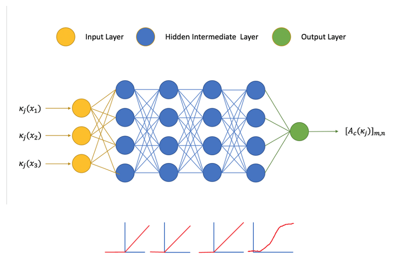

<style>
body {
text-align: justify;
font-size: 13pt}
</style>
```{r setup, include=FALSE}
knitr::opts_chunk$set(echo = TRUE)
```
_The following is a dialogue which aims at introducing us the dichotomy between Bayesianism and Frequentism, the two majors schools of statistical inference whose disagreements stem from fundamentally different philosophical assumptions and mathematical solutions to the statistical problems underlying nature. It has a lot of inaccuracies, and I'd be very grateful if you were to point them out. I'm still a learner of Bayesian statistics. Here, ThomStats, in honor to Thomas Bayes, is a character representing the former school of thought, while Fred, reminiscent of 'frequentism', would represent the latter. We'd witness the sudden interventions of AlexaNet (in reference to the deep neural network AlexNet) representing deep learning, and Simmball, representing the Symbolism school of thought._

_It's likely that we need to have some prior knowledge of both ThomStats and Fred, particularly their understanding of probability. _

<center>

__Chapter I: Hypotheses beyond data__

</center>

_An obscure stage is lightened up by a bright light. The curtains lift and we see two people conversing about statistics_

___ThomStats__: Well, to me, probability reflects the degree of certainty for a hypothesis I formulate towards certain event. This degree of belief can be moderated by feedback from the event of interest. For example, I begin by having a prior belief that most birds are white. Then, as I see more and more crows (black) in nature, my belief gets adjusted and I subsequently estimate a credible proportion of birds are actually white, just not most of them like before._ 

___Fred__:  Alas! There is some subjectivity lurking in there. Why did you start believing that most crows are white anyway? To me, probability is a confident conclusion objectively drawn from repeated measurement of a repeatable event. In the case above, I'll go on an adventure in nature and capture a sample of birds and confidently estimate the proportion of crows and white birds in what I consider to be repeatable measures_ 
<center>
{width=25%}

_
</center>
__ThomStats__: Fred, I don't understand why are you the most frequently taught and utilized statistical methodology.  

__Fred__: Well, maybe because I'm the most objective methodology between the two of us. 

__ThomStats__: Objective? Objectivity needs subjectivity to make sense and fit itself into the grand narrative of science. I mean, consider the following scenario: it's Monday, 14:00 and the day has become cloudy, up to the point that the afternoon sun rays have been blocked. You see that the clouds have also become a bit darker than usual, and insects and some birds are either flying in circles or gone hiding. How likely is it to rain?

__Fred__: Well, after __repeatedly re-reading__ your passage, I think it's _highly_ likely to rain. I mean, the data speaks for itself whereby all the signs of raining are displayed. 

$$argmax ~ L(Hyp|Evidence)$$

__Fred__: I try to choose a hypothesis that is most likely to fit the data given. 

__ThomStats__: Sure, I guess we can agree that it's likely to rain, albeit I won't say it's highly. You see, I first have some __hypothesis__ of the weather of Monday, which is formulated based on prior observations of the weathers in the days beforehand. We don't need to go into the details, but you and I know, or you can know while I must know to be precise, that in the past days where it doesn't rain far exceeds the number of days where it rains. With this kind of observation-based hypothesis that it's unlikely to rain, when I read the passage, although I can update my prior belief to the point that you and I seem to converge into believing that rain is about to happen, we got there from different starting points and may differ in the exact probability of raining. Although both of us may get similar probabilities, mine's is mostly in tuned in the process of scientific inquiry and exploration. I mean, why wouldn't even you remotely _consider_ a prior ratio of rainy days to non-rainy days? 

$$P(Hyp|Evidence)_{posterior} \propto P(Evidence|Hyp)_{likelihood} * P(Hyp)_{prior} $$
$$P(Rain|Passage) \propto P(Passage|Rain) * P(Rain)$$


__ThomStats__: The probability estimation of whether it's going to rain is based not only on the data (marked as likelihood), but rather it also depends on the prior, which would represent a guess, intuition or prior knowledge on the event in hand 

__Fred__: Wait, just hold your priors for a moment. How did you  begin talking about hypothesis of what ifs and what not when there is no prior data available. You just gave me a passage, a simple description of your IMAGINARY mental landscape of a non-existent Tuesday and clouds. For the record, I do formulate hypotheses. The whole methodology I propose tests for whether a data-driven hypothesis is null or not. 

__ThomStats__: Well, first of all, this is a THOUGHT experiment, and clearly thought is much needed when dealing with the objective world. Plus, to me, there is a vague, implicit essence of subjectivity in your statements where you associate dark clouds with rain. I mean, it didn't actually rain anyway...

__Fred__: You asked about my estimated probability of raining, and I'm being as objectively as possible in providing a confident estimate. Anyway, we shouldn't tell each other how we think of a problem. I mean, subjectivity is subservient to wild dispute. I feel like I'm being dragged around in your argument. Back to your question at the beginning, let us not answer it employing your thought experiments, but with actual data. Yeah. Let me show you what rigorous objectivity is based on real data analysis rather than abstract thought analysis.  


```{r describeStats, echo = TRUE, message=FALSE, warning=FALSE}
### Loading libraries
library(tidyverse)
library(sjPlot)
library(psych)
library(knitr)
library(car)
library(emmeans)
library(kableExtra)
library(rjags)
### Loading data and preprocessing, i.e., turning characters into factors interpretable by the models
insurance <- read_csv("insurance.csv") 
insurance = na.omit(insurance)        # eliminate missing data. No missing data
insurance$sex = as.factor(insurance$sex)
insurance$children = as.factor(insurance$children)
insurance$smoker = as.factor(insurance$smoker)
insurance$region = as.factor(insurance$region)

### Check dataset
head(insurance) %>%
  kable(digits = 2, caption = "First five samples of data") %>%
  kable_styling(full_width = TRUE)

### Descriptive statistics
describe(insurance, skew = FALSE) %>%
  kable(digits = 2, caption = "Descriptive statistics of the variables of the insurance dataset") %>%
  kable_styling(full_width = TRUE)
```
```{r pairsMED, fig.align = "center", warning=FALSE,  message=FALSE, echo = TRUE, error=FALSE, results='hide', fig.cap="Pairs plot which show the bivariate relationship between the variables of the insurance dataset", fig.keep='all'}
pairs.panels(insurance)
```

_As ThomStats and Fred were discussing, suddenly a dataset which contains the features measured from more than a thousand participants, including their medical expenses appears on stage_

__Fred__: Look, ThomStats. Here is a dataset that conveniently appeared in front of us so that we can debate on the legitimacy of our approaches, interpretations and models of probability. Namely, this dataset conveniently collected information of `r nrow(insurance)` participants, where they conveniently measured each person's age, sex, body mass index, number of children, whether they're smoker, in which region they live and the medical expenses they pay. Allow me to propose that we shall employ Multivariate Linear Regression to the dataset to illustrate the superiority of my objective, frequentist approach. Here, I'll use the conveniently collected features to predict each person's medical expenses. I don't mean disrespect, but my frequentist approach works solely with the dataset (referred as $D$), whereby the estimated parameters $\theta$ of my model are obtained by maximising the likelihood that the parameters fit the dataset. This is the same as minimising the mean squared error of the predictions of my model to the dependent variable $y$ of the dataset. Everything revolves around the data, and from this revolution stems a beautiful, elegant analytical equation that estimates the optimal parameters of the multivariate regression model $\hat \theta$. My frequentist approach has high data-fidelity, aka, reality-fidelity:

$$argmax~L(\theta | D) = argmin~MSE(\theta) = (X^TX)^{-1}X^Ty = \hat \theta  $$

__Fred__: Here $X$ is a matrix containing all the features (intercept included), except the outcome variable, and $y$ is the outcome variable. Let us run the below code which fits the model and estimates the parameter, where we can obtain the confidence intervals of the coefficients, reject or accept the null hypothesis of whether my coefficients are significant and perform statistical inference. Horay!

```{r, echo = TRUE, message=FALSE, warning=FALSE}

fred_mdl <- lm(charges ~ 1 + age + sex + bmi + children + smoker + region, data = insurance )
summary(fred_mdl)
```

__ThomStats__: Hmm...Let's see. Well, first, for someone who "upholds" fidelity to reality, you clearly don't seem to care much about what you mean by $p<0.05$ for some coefficients. As far as I'm concerned, it means that there is only 1 out of 20 possible world scenarios where your data sampling could have led to a different coefficient. But, I mean, who really, actually performs the same sampling process, or the same experiment about 20 times in a row and actually checks whether in exactly one of them they'd get different estimated coefficient. That's, as far as I'm concerned, IMAGINARY. Not that I'm judging though.  

__Fred__: It's a thought experiment. 

__ThomStats__: Anyhow, since you've shared your way of how to estimate parameters, let me also share with you the beauty of how I would estimate parameters. 
$$P(\theta | D) \propto P(D|\theta) * P (\theta)$$
$$Posterior \propto Likelihood * Prior$$

__ThomStats__: Here, while it looks like I'm trying to estimate a numerical value of probability (like 0.35 or 0.58), it's not. I'm trying to estimate the parameters of a posterior distribution which most likely fits the variables of the dataset. Particularly, the likelihood is fundamentally proportional to the frequentist likelihood. It belongs to a normal distribution with mean equal to $\theta X$ and variance $sigma^2$:
$$P(D|\theta) \sim N(\theta X, \sigma^2) = N((X^TX)^{-1}X^Ty, \sigma^2)$$

__ThomStats__: Alas! If we were to use a flat prior, as in $P(\theta) = 1$, then $P(\theta | D) \propto P(D|\theta) \propto L(\theta | D)$, then my posterior would be the same as your maximum likelihood estimate and both of our estimated coefficients would be the same. In some sense frequentism can be thought as bayesianism with a flat prior. 

__Fred__: ...

__ThomStats__: I seem to be obligued to avoid flat priors. I guess from your monologue, there seems to be some misunderstanding on our priors. First of all, although prior beliefs are integral part of our approach to probability, they're don't decide everything. As you can see from the equations above us, our prior beliefs are __moderated/updated by the likelihood of data__, i.e., our hypothesis changes as we observe the real world. In this case of linear regression, a subjective choice of priors simply means that for each of the coefficients to be estimated in the likelihood, I take a __guess of the parameters of the distribution most likely to fit the coefficients__. Fred, my friend, your methodology can be interpreted as estimating the parameters of the distribution directly from data. 

__Fred__: You see, you're using the word 'guess', and your guess can be so out-of tune with reality such that no matter how the likelihood of data tries to update your prior beliefs, your coefficients might be so far off.

__ThomStats__: We also are rigorous in the formulation of our priors. Recall the thought experiment of the rainy day above, where I have to actively search for days prior to Tuesday and count in which days they rained and which ones didn't. By analogy, for each of the coefficients, such as for age, sex, children, BMI, children and region, I may have to do an extensive research to find what kind of normal distribution (with what mean and variance) would fit the each of them well. Say, that the average number of children in a population is 2, and the variance is 1. That'd be my prior that'd get moderated by the likelihood in the context of predicting medical expenses. 

__Fred__: Wait a moment. While this dataset did appear in front of us so conveniently, I don't know what kind of population it reflects. It could belong to a population where there is an intrinsic skew in the BMI or age. You could still choose a wrong prior. And this is happening even for this very constrained dataset where we perform simple linear regression with less than 10 variables. 

__ThomStats__: Indeed, my friend. But, while the choice of priors is indeed rigorous the choice of priors, we can still relax this choice by going for "uninformative" or vague priors, which are generalizable and we don't need to do extensive research of what prior is suitable per each coefficient. Take BMI for example. Instead of trying to guess a precise prior normal distribution, I can choose the parameters of this prior normal distribution to be of zero mean and 1000000 variance, so that the normal distribution is so spread out, and then let the likelihood update it. In the rainy day thought experiment, this is analogous to having a hypothesis that 'all days can theoretically rain'. It's not saying anything in particular, but the available data can update this hypothesis.

__Fred__: Your methodology sounds complicated and tedious.

__ThomStats__: It IS complicated and tedious. I haven't even told you how we 'update' the priors. Because it's computationally intractable to estimate the distribution of each of the parameters in the context of predicting the outcome variable, we have to sampling method. Particularly, we use the Markov Chain Monte Carlo algorithm. Avoiding technicalities, it tries to perform parameter estimation by taking a random walk which samples random values from a posterior distribution which is proportional to the likelihood times the prior. It's a Markov process because the next sampled random value depends on the immediately before sampled value. Let's look and run the below code: 


```{r, echo = TRUE, message=FALSE, warning=FALSE, results='hide'}
mod_string = "model{
  ### 1. Likelihood
  for (i in 1:length(charges)) {
		charges[i] ~ dnorm(mu[i], prec ) # Proportional to MLE in the frequentist approach
		mu[i] = b0 + b[1] * age[i] + b[2] * sex[i] + 
		b[3] * bmi[i] + b[4] * children[i] + b[5] * smoker[i] +
		b[6] * region[i]
  }
  
  ### 2. Specifying the PRIOR
  ## use a vaguely informative prior, where there is zero mean and a very spread out variance. PS: I don't know why I have to write 1/1e6 to specify an uninformative prior
  b0 ~ dnorm(0, 1/1e6)
  for (j in 1:6){
    b[j] ~ dnorm(0, 1/1e6)
  }
  ### Nested prior for variance of posterior distribution
	prec ~ dgamma(5/2, 5*10/2)
  sig2 = 1/prec   
  sig = sqrt(sig2)
} 
"
set.seed(42) # Model parameters assumed to be random in Bayesianism

# One to one mapping of variables in dataset to model
data_jags = as.list(insurance)

params = c("b0", "b") # these are the parameters to be estimated using MCMC

# 3. Initializing and running MCMC
mod = jags.model(textConnection(mod_string), data = data_jags, n.chains = 3)
update(mod, 1000)
mod_sim <- coda.samples(model=mod, variable.names = params, n.iter = 5e3)
mod_csim <- as.mcmc(do.call(rbind, mod_sim))


```

```{r, echo = TRUE, message=FALSE, warning=FALSE}
# Model Summary
summary(mod_sim)
```

__Fred__: We get different results. See! It must be because of your subjective choice of priors. You have no confidence intervals nor any sort of data-fidelity. 

__ThomStats__: Well I've just gave an explanation of how my priors interact with the likelihood. Switching topics, you've mentioned confidence intervals. My methodology doesn't have 'confidence' intervals, but rather 'credible' intervals. Your interpretation of 'confidence' intervals stems from your assumption that your data collection process is subject to change, so depending on how and what you sample from the population, each time a linear regression model that's fit to your sample of data would have some slight variations in the parameters to be estimated. 

__Fred__: Isn't that how reality works? Data collection can be fundamentally random, data can be random, and my model should be robust in addressing this randomness. If I were to resample and fit my model multiple times, I'm 95% confident that I'll get the coefficients lying within the confidence interval. 

__ThomStats__: Well, as I said before, it strikes me as odd that you imagine running an experiment multiple times and expect it to give similar results most of the time, because nobody actually re-samples and does the same statistics 20 times or 100 times in a row to check whether estimated coefficients are within an interval.  Anyhow, don't you think your assumption is strange? Assuming that the data you've sampled is representative of the population, that is, data is collected randomly and in a controlled manner, then shouldn't we be more concerned about whether our model can be random? 


__Fred__: Random model? As in random parameters?

__ThomStats__: Indeed, my dear friend. Our model parameters are the one subject to randomness, and we should focus more on quantifying the randomness of our model. Because I'm assuming that each coefficient is extracted from a probability distribution, then I can confidently talk about values which each coefficient can take and lie within 'credible' intervals. We call this process of quantifying randomness as __uncertainty__. And your frequentist methodology, my dear friend, certainly doesn't address the issue of __uncertainty__. 

_As ThomStats and Fred are discussing, a new character called "Experimental Replication Crisis" emerges to the stage_

__Replication Crisis__: Hello, fellow statisticians. I have nothing to say other than my existence is really inconvenient to both of you. Or should I say that both of your methodologies contribute to the tactility of my existence. I mean, why do you carry the assumption that data collected in any experiment or data coming from any dataset is representative of any population. I mean, the population lives in a natural setting, not controlled setting, and behaviour is not static as to be captured by a photo, but rather fluidic as to be captured by a video called lifetime...

_ThomStats and Fred kept on passionately discussing without paying much attention to this new character_ 

__Replication Crisis__: This is probably one of the fundamental reasons why I exist 

_ThomStats and Fred kept on discussing for a while on the randomness of data and model parameters for a while. Another characters set foot on stage_ 

__ThomStats__: All I'm saying is that uncertainty is inherently in nature, in probability, and it's actually quantified through bayesianism. 

__AlexaNet (interrupting suddenly):__ Hey, hey. I don't mean to bother you fellow statisticians, but data in nature is fundamentally random, as well as our models' parameter estimation process and subsequently the estimated values should all be inherently probabilistic. Therefore, it's normal for my deep learning models to estimate different parameters (sometimes radically different parameters) per each different randomized initialization, as well as have some parameters that are dropped out, i.e. become zero, to avoid overfitting, as well as parameters being rescaled to prevent gradient vanishing, as well as have a total of billions of parameters (with the scale increasing), and also having different topologies in arranging those parameters such as in filters or memory cells, and also... 

__ThomStats and Fred (yelling):__ your parameters are not interpretable, nor explainable!

__AlexaNet:__ Well you can't tackle problems where variables don't share monotonic relationships. I mean, sometimes I wonder and I realize that it sounds like a tautology some of the assumptions of the linear models you run. "The linear regression model assumes that variables share a linear relationship". 





__ThomStats__: I think you're mixing up problem-solving and doing statistics. While statistics can be an integral part of problem-solving, data analysis doesn't equal problem-solving. The latter at least requires the formation of hypothesis about the world and at least some way to test whether this hypothesis is coherent with how reality works. 

_While ThomStats explains, one last character intervenes_

__Simmball__: My intervention today is brief as I have nothing much to say other than, indeed, while working with data is powerful, I think a powerful model should at least make sense of data and to check how it fits with its own knowledge. At least the deductive models I've proposed, part of symbolism, encourages us to reason and make sense of data through the use of a fundamental trait of nature: math. Math, which, I may add, will not fall prey to irreproducibility. Speaking of which, haven't you noticed that you made Replication Crisis drown itself in tears of agony? 

__ThomStats and Fred (in unison):__ Well, it's not our fault that Replication Crisis exists. We're blind to the methodologies adopted by humans in the reesearch data collection process and experimental design. They should change their ways and collect generalizable data. We technically can't ensure the fidelity and generalizability of data _collected_. 

__AlexaNet:__ Well, that's a limitation challenged by automation. As I evolve, I'll need less carefully collected and processed data and I'll slowly start working with unstructured data and solve problems you both could ever dream of solving. 

__ThomStats:__ well, you've clearly learnt a lot from Fred on working with data. But AlexaNet, you really have to consider also learning how to __create hypothesis__ that may not necessarily stem from the data itself, but rather from your prior knowledge from observing the world. You need ideas to complement your expertise in probability. __You need thought beyond data__.  

_The stage lets down its curtains. And on what seems to be concluding remark by ThomStats will hopefully emerge new pursuits on how to make sense of this world beyond the data that's collected_

__References__


Arnold, J. B. (n.d.). A Set of Bayesian Notes. In jrnold.github.io. Retrieved April 3, 2022, from https://jrnold.github.io/bayesian_notes/

Heiner, M. (n.d.). Bayesian Statistics: Techniques and Models. Coursera - University of California, Santa Cruz. Retrieved April 2, 2022, from https://www.coursera.org/learn/mcmc-bayesian-statistics/

Sanderson, G. (2022, February 14). 3Blue1Brown - Bayes’ theorem. 3blue1brown. https://www.3blue1brown.com/lessons/bayes-theorem

Sprenger, J. (2013). Bayesianism vs. Frequentism in Statistical Inference. http://www.laeuferpaar.de/Papers/Bayes-vs-Freq-final-nodbl.pdf

VanderPlas, J. (2014a). Frequentism and Bayesianism: A Practical Introduction | Pythonic Perambulations. Jakevdp.github.io. http://jakevdp.github.io/blog/2014/03/11/frequentism-and-bayesianism-a-practical-intro/

VanderPlas, J. (2014b). Frequentism and Bayesianism: A Python-driven Primer. Arx. https://doi.org/https://doi.org/10.48550/arXiv.1411.5018

